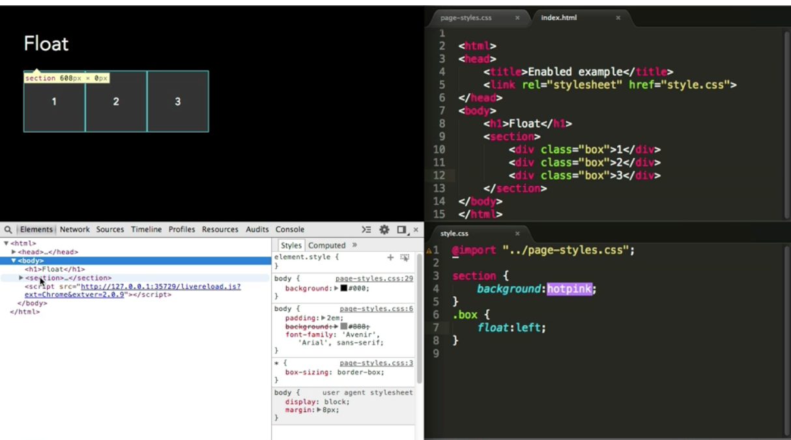

在页面布局中,了解`盒子模型`,`浮动定位`是很重要的
`float`属性具有三个值`left`,`right`,`none`
`浮动定位的含义：`脱离文档流。浮动到另外一个浮动框的周围或者其包含框。


##### 掌握浮动定位需要了解的东西
1. the intended use
2. multi-column layouts
3. clearing the effect of float
4. container collapse
5. 浮动元素和文档流之间的关系

##### 浮动定位最初的目的
it's original purpose was to allow text to wrap around an object
 让文字环绕在图片的周围。

when elements `float` adjacent elements flow around them
当一个元素是`float`的时候,周围的元素会环绕在其周围.

 让文字环绕在图片的周围。
http://runjs.cn/code/nznhthje

##### multi-column layouts

通过开发者工具,可以看到,section部分的height为0,


##### clearing the effect of float
可以通过`block formatting contexts`来清除浮动元素的影响

下面这种方式是最常见的方式
```
.cf:before,
.cf:after{
    content:" ";
    display:table;
}
.cf:after{
    clear:both;
}

```

##### 高度塌陷

##### 浮动元素和文档流之间的关系


参考文献:
http://www.atozcss.com/intermediate/video/float-and-clear/
