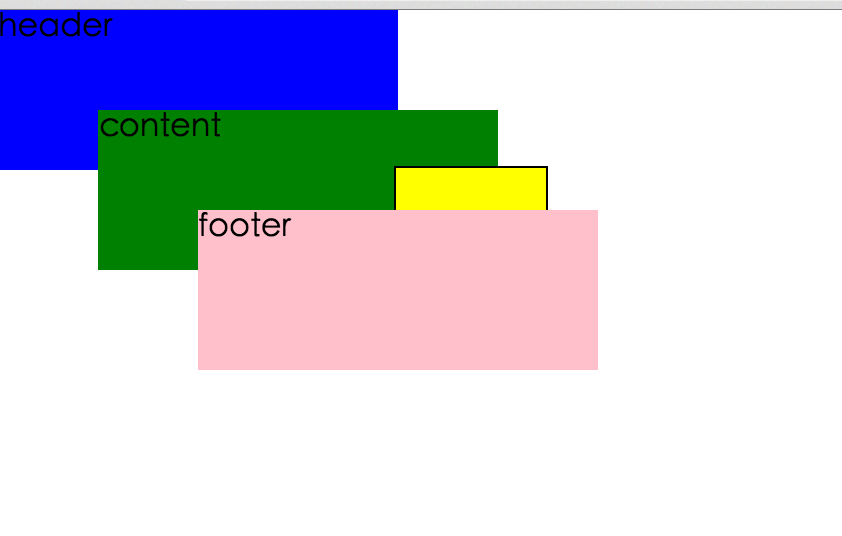

### theory

z-index 属性设置元素的堆叠顺序。拥有更高堆叠顺序的元素总是会处于堆叠顺序较低的元素的前面。
注释：元素可拥有负的 z-index 属性值。
注释：Z-index 仅能在定位元素上奏效（例如 position:absolute;）！

元素的堆叠顺序可以通过`position`和`z-index`来设置.

#### 关于z-index需要了解的问题
1. the default stacking order of the document?
2. what a stacking context is and how they interact
3. how z-index controls layer order
4. and a method I use for standardising z-index across a project

##### `default stacking`
when writing HTML,elements that appear lower down in the document,
naturally stack above elements further up
在默认的情况下,后面的元素会一个挨着一个的进行排列

但是.......
elements can be overlapped using a combination fo `position` and offset
properties `top`,`right`,`bottom` and `left`.

##### `stacking context`
1. an element with position `absolute` or `relative` and a `z-index` value
that not `auto`
2. a flexbox item with `z-index` that's not `auto`
3. an element whit `opacity` less than 1
4. an element with `transform` set to anything other than `none`

##### `z-index within stacking context`

黄色盒子`z-index`属性的值很大(大于粉色盒子的`z-index`),但是不能正常显示的原因
在与`z-index within stacking context`

all`z-index`values are resolved within their parent stacking context
`z-index`相对于其父元素`stacking context`
think of `z-index` within a stacking context as a sub-item of an ordered list

`因此在哪个有问题的例子中`
header z-index   1
main z-index     2
   box z-index   2.9999
footer z-index   3

##### `z-index strategy`
1. what if you want to add an element between `z-index:3` and `z-index:4`

I like to use a `z-index` scale that goes up in steps of 10
the other benefit of using a scale with multiples of 10 is that there are 
9 possible values you can pick between `10` and `20`
but none that you can pick between `1` and `2`

参考文献:
http://www.w3school.com.cn/cssref/pr_pos_z-index.asp
http://www.atozcss.com/advanced/video/the-z-index-css-property/