## 基础表单
**表单主要功能**
是用来与用户做交流的一个网页控件，良好的表单设计能够让网页与用户更好的沟通。
**表单中常见的元素主要包括：**
`文本输入框、下拉选择框、单选按钮、复选按钮、文本域和按钮`等。其中每个控件所起的作用都各不相同，而且不同的浏览器对表单控件渲染的
风格都各有不同。

同样，表单也是Bootstrap框架中的核心内容，下面向大家介绍Bootstrap框架中表单的制作。

**表单源码查询**

Bootstrap框架的表单，其源码占据了大量的代码，同样的，根据不同的Bootstrap版本，你可以轻松获取相应的源码：

   ?   LESS版本：对应源文件 forms.less

   ? ?  Sass版本：对应源文件 _forms.scss

编译后的Bootstrap版本，可以查阅bootstrap.css文件第1630行~第1991行

不过在样式表中，还对表单做了一些初始化，详细代码可以查阅bootstrap.css文件第110行~第178行。

对于基础表单，Bootstrap并未对其做太多的定制性效果设计，仅仅对表单内的fieldset、legend、label标签进行了定制。如：
```
/*源码请查阅bootstrap.css文件第1631行~第1652行*/

fieldset {
min-width: 0;
padding: 0;
margin: 0;
border: 0;
}
legend {
display: block;
width: 100%;
padding: 0;
margin-bottom: 20px;
font-size: 21px;
line-height: inherit;
color: #333;
border: 0;
border-bottom: 1px solid #e5e5e5;
}

label {
display: inline-block;
margin-bottom: 5px;
font-weight: bold;
}
```
主要将这些元素的margin、padding和border等进行了细化设置。

**form-control类的作用**
当然表单除了这几个元素之外，还有input、select、textarea等元素，在Bootstrap框架中，通过定制了一个类名`form-control`，
也就是说，如果这几个元素使用了类名“form-control”，将会实现一些设计上的定制效果。

1、宽度变成了100%
```
width: 100%;
```
2、设置了一个浅灰色（#ccc）的边框
```
  border: 1px solid #ccc;
```
3、具有4px的圆角
```
border-radius: 4px;
```
4、设置阴影效果，并且元素得到焦点之时，阴影和边框效果会有所变化
```
  border-color: #66afe9;
  outline: 0;
  -webkit-box-shadow: inset 0 1px 1px rgba(0,0,0,.075), 0 0 8px rgba(102, 175, 233, .6);
          box-shadow: inset 0 1px 1px rgba(0,0,0,.075), 0 0 8px rgba(102, 175, 233, .6);
```
5、设置了placeholder的颜色为#999
```
.form-control::-moz-placeholder {
  color: #999;
  opacity: 1;
}
.form-control:-ms-input-placeholder {
  color: #999;
}
.form-control::-webkit-input-placeholder {
  color: #999;
}
```
6:设置了display:block
```
display: block;
```


详细请查阅bootstrap.css文件第1690行~第1732行。

### 
水平表单
Bootstrap框架默认的表单是垂直显示风格，但很多时候我们需要的水平表单风格（标签居左，表单控件居右）见下图。

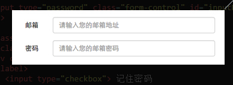

在Bootstrap框架中要实现水平表单效果，必须满足以下两个条件：
1、在`<form>`元素是使用类名“form-horizontal”。
2、配合Bootstrap框架的网格系统。（网格布局会在以后的章节中详细讲解）

在`<form>`元素上使用类名“form-horizontal”主要有以下几个作用：
1、设置表单控件padding和margin值。
2、改变“form-group”的表现形式，类似于网格系统的“row”。(这个可能是网格系统设置导致的发现在form-horizontal使用了清除浮动
说明网格系统的实现依赖的浮动定位)

```
/*源码请查阅bootstrap.css文件第1963行~第1991行*/
.form-horizontal .control-label,
.form-horizontal .radio,
.form-horizontal .checkbox,
.form-horizontal .radio-inline,
.form-horizontal .checkbox-inline {
padding-top: 7px;
margin-top: 0;
margin-bottom: 0;
}
.form-horizontal .radio,
.form-horizontal .checkbox {
min-height: 27px;
}
.form-horizontal .form-group {
margin-right: -15px;
margin-left: -15px;
}
.form-horizontal .form-control-static {
padding-top: 7px;
}
@media (min-width: 768px) {
.form-horizontal .control-label {
text-align: right;
  }
}
.form-horizontal .has-feedback .form-control-feedback {
top: 0;
right: 15px;
}
```

来看一个简单的示例：
```
<form class="form-horizontal" role="form">
<div class="form-group">
  <label for="inputEmail3" class="col-sm-2 control-label">邮箱</label>
  <div class="col-sm-10">
  <input type="email" class="form-control" id="inputEmail3" placeholder="请输入您的邮箱地址">
  </div>
  </div>
  <div class="form-group">
  <label for="inputPassword3" class="col-sm-2 control-label">密码</label>
  <div class="col-sm-10">
  <input type="password" class="form-control" id="inputPassword3" placeholder="请输入您的邮箱密码">
  </div>
  </div>
  <div class="form-group">
  <div class="col-sm-offset-2 col-sm-10">
  <div class="checkbox">
  <label>
  <input type="checkbox">记住密码
  </label>
  </div>
  </div>
  </div>
  <div class="form-group">
  <div class="col-sm-offset-2 col-sm-10">
  <button type="submit" class="btnbtn-default">进入邮箱</button>
  </div>
</div>
</form>
```
最后的效果


### 内联表单
有时候我们需要将表单的控件都在一行内显示，类似这样的：


在Bootstrap框架中实现这样的表单效果是轻而易举的，你只需要在`<form>`元素中添加类名`“form-inline”`即可。
内联表单实现原理非常简单，欲将表单控件在一行显示，就需要将表单控件设置成内联块元素（display:inline-block）。
/*源码请查阅bootstrap.css文件第1928行~第1962行*/
```
  .form-inline .form-group {
    display: inline-block;
    margin-bottom: 0;
    vertical-align: middle;
  }
```


如果你要在input前面添加一个label标签时，会导致input换行显示。如果你必须添加这样的一个label标签，并且不想让input换行，
你需要将label标签也放在容器“form-group”中，如：
```
<div class="form-group">
    <label class="sr-only" for="exampleInputEmail2">Email address</label>
</div>
<div class="form-group">
    <input type="email" class="form-control" id="exampleInputEmail2" placeholder="Enter email">
</div>
```

接下来，我们还是以实例说话：
```
<form class="form-inline" role="form">
<div class="form-group">
  <label class="sr-only" for="exampleInputEmail2">邮箱</label>
  <input type="email" class="form-control" id="exampleInputEmail2" placeholder="请输入你的邮箱地址">
</div>
<div class="form-group">
  <label class="sr-only" for="exampleInputPassword2">密码</label>
  <input type="password" class="form-control" id="exampleInputPassword2" placeholder="请输入你的邮箱密码">
</div>
<div class="checkbox">
<label>
   <input type="checkbox">记住密码
</label>
</div>
<button type="submit" class="btnbtn-default">进入邮箱</button>
</form>
```
运行效果如下或查看右侧结果窗口：(查看效果需要把结果窗口设置为全屏)


回过头来看示例，你或许会问，为什么添加了label标签，而且没有放置在”form-group”这样的容器中，input也不会换行；
还有label标签怎么没显示出来。如果你仔细看，在label标签运用了一个类名“sr-only”，标签没显示就是这个样式将标签隐藏了。
```
/*源码请查阅bootstrap.css文件第342行~第350行*/
.sr-only {
position: absolute;
width: 1px;
height: 1px;
padding: 0;
margin: -1px;
overflow: hidden;
clip: rect(0, 0, 0, 0);
border: 0;
}
```
注意：那么Bootstrap为什么要这么做呢？这样不是多此一举吗？其实不是的，如果没有为输入控件设置label标签，屏幕阅读器将无法正确识别。
这也是Bootstrap框架另一个优点之处，为残障人员进行了一定的考虑。

如果
**总结**
这个地方还是很值得学习的
1：css优先级,,权重
2：display:inline-block下的width属性如果设置为百分比的形式，这个时候会发生什么。


### 表单控件(输入框input)
在Bootstrap中使用`input时也必须添加type类型`，如果没有指定type类型，将无法得到正确的样式，
因为Bootstrap框架都是通过`input[type=“?”](其中?号代表type类型，比如说text类型，对应的是input[type=“text”])`的形式来
定义样式的。

为了让控件在各种表单风格中样式不出错，需要添加类名“form-control”，如：
```
<form role="form">
<div class="form-group">
<input type="email" class="form-control" placeholder="Enter email">
</div>
</form>
```

**总结**

* 在bootstrap中并没有为`input[type="email"]`专门的设置样式。`email`的样式其实是来自于`form-control`
* 对于`form-control`的样式是需要记住的
    1.宽度为100%的块状元素
    2.高度为34px，字体大小为14px，
    3：字体颜色，背景颜色，背景图片。
    4：边框，边框是有弧度的。
* `form-group` 
    1.清除浮动
    2.设置底部外边距

### 表单控件(下拉选择框select)
Bootstrap框架中的下拉选择框使用和原始的一致，多行选择设置multiple属性的值为multiple。
Bootstrap框架会为这些元素提供统一的样式风格。如：
```
<form role="form">
<div class="form-group">
  <select class="form-control">
    <option>1</option>
    <option>2</option>
    <option>3</option>
    <option>4</option>
    <option>5</option>
  </select>
  </div>
  <div class="form-group">
  <select multiple class="form-control">
    <option>1</option>
    <option>2</option>
    <option>3</option>
    <option>4</option>
    <option>5</option>
  </select>
</div>
</form>
```

**总结**

* 其实重点还是两个class，`form-group`和`form-control`

### 表单控件(文本域textarea)
文本域和原始使用方法一样，设置`rows`可定义其高度，设置`cols`可以设置其宽度。

**特别注意的地方**
如果textarea元素中添加了类名“form-control”类名，则`无需设置cols属性`。
因为Bootstrap框架中的“form-control”样式的表单控件宽度为100%或auto。
```
<form role="form">
  <div class="form-group">
    <textarea class="form-control" rows="3"></textarea>
  </div>
</form>
```

### 表单控件(复选框checkbox和单选择按钮radio)

Bootstrap框架中checkbox和radio有点特殊，
主要是checkbox和radio与label标签配合使用会出现一些小问题（最头痛的是`对齐问题`）。
>那么对齐问题在bootstrap中是如何处理的呢？ 

使用Bootstrap框架，开发人员无需考虑太多，只需要按照下面的方法使用即可。
```
<form role="form">
<div class="checkbox">
<label>
<input type="checkbox" value="">
记住密码
</label>
</div>
<div class="radio">
<label>
<input type="radio" name="optionsRadios" id="optionsRadios1" value="love" checked>
喜欢
</label>
</div>
<div class="radio">
<label>
<input type="radio" name="optionsRadios" id="optionsRadios2" value="hate">
不喜欢
</label>
</div>
</form>
```
运行效果如下或查看右侧结果窗口（案例1）：


从上面的示例，我们可以得知：
1、不管是checkbox还是radio都使用label包起来了
2、checkbox连同label标签放置在一个名为“.checkbox”的容器内
3、radio连同label标签放置在一个名为“.radio”的容器内
在Bootstrap框架中，主要借助“.checkbox”和“.radio”样式，来处理复选框、单选按钮与标签的对齐方式。
源码请查看bootstrap.css文件第1742行～第1762行：
```
.radio,
.checkbox {
display: block;
min-height: 20px;
padding-left: 20px;
margin-top: 10px;
margin-bottom: 10px;
}
.radio label,
.checkbox label {
display: inline;
font-weight: normal;
cursor: pointer;
}
.radio input[type="radio"],
.radio-inline input[type="radio"],
.checkbox input[type="checkbox"],
.checkbox-inline input[type="checkbox"] {
float: left;
margin-left: -20px;
}
.radio + .radio,
.checkbox + .checkbox {
margin-top: -5px;
}
```
**总结**
1：为什么不使用“fom-group”进行包裹，要使用"checkbox"或者是"radio"来进行包裹
    1.checkbox,radio使用了盒子模型进行定位。还有块状元素和最小高度的定位机制来实现。
    2.`form-group`只是实现了浮动定位和底部的外边距。
2;主要看你是需要实现什么样的效果吧。    
3：使用class="radio" 需要注意的是，这个没有使用清楚浮动，但是.radio input[type="radio"] 中却是使用了浮动定位的。
   


### 表单控件(复选框和单选按钮水平排列)

1、如果checkbox需要水平排列，只需要在label标签上添加类名“checkbox-inline”
2、如果radio需要水平排列，只需要在label标签上添加类名“radio-inline”
如下所示：
```
<form role="form">
  <div class="form-group">
    <label class="checkbox-inline">
      <input type="checkbox"  value="option1">游戏
    </label>
    <label class="checkbox-inline">
      <input type="checkbox"  value="option2">摄影
    </label>
    <label class="checkbox-inline">
    <input type="checkbox"  value="option3">旅游
    </label>
  </div>
  <div class="form-group">
    <label class="radio-inline">
      <input type="radio"  value="option1" name="sex">男性
    </label>
    <label class="radio-inline">
      <input type="radio"  value="option2" name="sex">女性
    </label>
    <label class="radio-inline">
      <input type="radio"  value="option3" name="sex">中性
    </label>
  </div>
</form>
```
运行效果如下或查看右侧结果窗口：
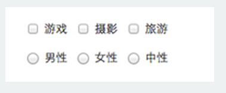

实现源码请查看bootstrap.css文件第1767行～第1780行：
```
.radio-inline,
.checkbox-inline {
display: inline-block;
padding-left: 20px;
margin-bottom: 0;
font-weight: normal;
vertical-align: middle;
cursor: pointer;
}
.radio-inline + .radio-inline,
.checkbox-inline + .checkbox-inline {
margin-top: 0;
margin-left: 10px;
}
```

这里的关键是display:inline-block

**总结**
1：display:block + float:left
2:dispaly:inline-block
3:radio标签的name属性

### 表单控件(按钮)
按钮也是表单重要控件之一,制作按钮通常使用下面代码来实现：

  ?  input[type=“submit”]

  ?  input[type=“button”]

  ?  input[type=“reset”]

  ?  <button>

在Bootstrap框架中的按钮都是采用<button>来实现。

有关于Bootstrap中按钮如何制作，在这里不做过多阐述，因为按钮也是Bootstrap框架中核心部分之一，后面我们专门有一节内容来介绍Bootstrap的按钮。

这里先让大家看看Bootstrap的按钮长成什么样：
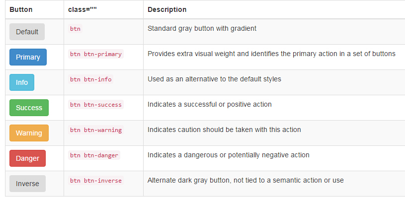

### 表单控件大小
前面看到的表单控件都正常的大小。可以通过设置控件的height，line-height，padding和font-size等属性来实现控件的高度设置。
不过Bootstrap框架还提供了两个不同的类名，用来控制表单控件的高度。这两个类名是：
1、`input-sm`:让控件比正常大小更小
2、`input-lg`:让控件比正常大小更大

这两个类适用于表单中的input，textarea和select控件，具体使用如下：
```
<input class="form-control input-lg" type="text" placeholder="添加.input-lg，控件变大">
<input class="form-control" type="text" placeholder="正常大小">
<input class="form-control input-sm" type="text" placeholder="添加.input-sm，控件变小">
```
运行效果如下或查看右侧结果窗口：
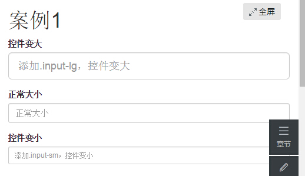

源码请查阅bootstrap.css文件第1795~第1824行：
```
.input-sm {
height: 30px;
padding: 5px 10px;
font-size: 12px;
line-height: 1.5;
border-radius: 3px;
}
select.input-sm {
height: 30px;
line-height: 30px;
}
textarea.input-sm,
select[multiple].input-sm {
height: auto;
}
.input-lg {
height: 46px;
padding: 10px 16px;
font-size: 18px;
line-height: 1.33;
border-radius: 6px;
}
select.input-lg {
height: 46px;
line-height: 46px;
}
textarea.input-lg,
select[multiple].input-lg {
height: auto;
}
```

从上面的源码中不难发现，不管是“input-sm”还是“input-lg”仅对控件高度做了处理。
但往往很多时候，我们需要控件宽度也要做一定的变化处理。这个时候就要借住Bootstrap框架的网格系统。
上面的控件的宽度全是100%
所以你要控制表单宽度，可以像下面这样使用：
```
<form role="form" class="form-horizontal">
  <div class="form-group">
  <div class="col-xs-4">
    <input class="form-control input-lg" type="text" placeholder=".col-xs-4">
  </div>
  <div class="col-xs-4">
    <input class="form-control input-lg" type="text" placeholder=".col-xs-4">
  </div>
  <div class="col-xs-4">
    <input class="form-control input-lg" type="text" placeholder=".col-xs-4">
  </div>
  </div>
    …
</form>
```
注：网格布局在后面章节中会进行详细讲解。

运行效果如下或查看右侧结果窗口：
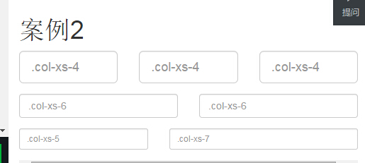


前面介绍水平表单时说过，如果表单使用了类名“form-horizontal”，其中“form-group”就相当于网格系统中的“row”。
换句话说，如果没有这样做，要通过网格系统来控制表单控件宽度，就需要这样使用：
```
<div class="row">
<div class="col-xs-4">
<input class="form-control input-lg" type="text" placeholder=".col-xs-4">
</div>
<div class="col-xs-4">
<input class="form-control input-lg" type="text" placeholder=".col-xs-4">
</div>
<div class="col-xs-4">
<input class="form-control input-lg" type="text" placeholder=".col-xs-4">
</div>
</div>
```

**总结**
1：`input-sm`
2:`input-lg`
3:`row`
4:`form-horizontal`
5:`col-xs-4`

### 表单控件状态(焦点状态)
**焦点状态**
通过伪类“:focus”来实现。

**Bootstrap框架中表单控件的焦点状态**
删除了outline的默认样式，重新添加阴影效果。
```
.form-control:focus {
border-color: #66afe9;
outline: 0;
  -webkit-box-shadow: inset 0 1px 1pxrgba(0,0,0,.075), 0 0 8px rgba(102, 175, 233, .6);
box-shadow: inset 0 1px 1pxrgba(0,0,0,.075), 0 0 8px rgba(102, 175, 233, .6);
}
```
 从源码中我们可以看出，要让控件在焦点状态下有上面样式效果，需要给控件添加类名“form-control”：
```
<form role="form" class="form-horizontal">
  <div class="form-group">
    <div class="col-xs-6">
      <input class="form-control input-lg" type="text" placeholder="不是焦点状态下效果">
    </div>
    <div class="col-xs-6">
      <input class="form-control input-lg" type="text" placeholder="焦点点状态下效果">
    </div>
  </div>
</form>
```
运行效果如下或查看右侧结果窗口：


（鼠标单击输入框，使其获得焦点就可以看到加入蓝色边框效果）

在Bootstrap框架中，file、radio和checkbox控件在焦点状态下的效果也与普通的input控件不太一样，主要是因为Bootstrap对他们做了一些特殊处理：
/*源码查看boostrap.css文件第1676行～第1682行*/
```
input[type="file"]:focus,
input[type="radio"]:focus,
input[type="checkbox"]:focus {
outline: thin dotted;
outline: 5px auto -webkit-focus-ring-color;
outline-offset: -2px;
}
```
**总结**
在bootstrap已经自动的为`file`,`radio`,`checkbox`控件添加上了在获取焦点的时候应该具有的效果。
在页面中也无须进行特别的设置。
学习这一小节主要是了解伪类`:focus`

### 表单控件状态(禁用状态)
Bootstrap框架的表单控件的禁用状态和普通的表单禁用状态实现方法是一样的，在相应的表单控件上添加属性“disabled”。
**和其他表单的禁用状态不同的是**
Bootstrap框架做了一些样式风格的处理：
/*源码请查看bootstrap.css文件第1723行～第1729行*/
```
.form-control[disabled],
.form-control[readonly],
fieldset[disabled] .form-control {
cursor: not-allowed;
background-color: #eee;
opacity: 1;
}
```
1:鼠标放在控件上的样式--禁止
2：背景颜色--灰色
2：完全透明

**使用方法为：**
只需要在需要禁用的表单控件上加上“disabled”即可：
```
<input class="form-control" type="text" placeholder="表单已禁用，不能输入" disabled>
```

在使用了“form-control”的表单控件中，样式设置了禁用表单背景色为灰色，而且手型变成了不准输入的形状。
如果控件中不使用类名“form-control”，禁用的控件只会有一个不准输入的手型出来。
/*源码请查阅bootstrap.css文件第1781行～第1794行*/
```
input[type="radio"][disabled],
input[type="checkbox"][disabled],
.radio[disabled],
.radio-inline[disabled],
.checkbox[disabled],
.checkbox-inline[disabled],
fieldset[disabled] input[type="radio"],
fieldset[disabled] input[type="checkbox"],
fieldset[disabled] .radio,
fieldset[disabled] .radio-inline,
fieldset[disabled] .checkbox,
fieldset[disabled] .checkbox-inline {
cursor: not-allowed;
}
```
在Bootstrap框架中，如果`fieldset`设置了`disabled`属性，整个域都将处于被禁用状态。
```
<form role="form">
<fieldset disabled>
  <div class="form-group">
  <label for="disabledTextInput">禁用的输入框</label>
    <input type="text" id="disabledTextInput" class="form-control" placeholder="禁止输入">
  </div>
  <div class="form-group">
  <label for="disabledSelect">禁用的下拉框</label>
    <select id="disabledSelect" class="form-control">
  <option>不可选择</option>
  </select>
  </div>
  <div class="checkbox">
  <label>
    <input type="checkbox">无法选择
  </label>
  </div>
  <button type="submit" class="btnbtn-primary">提交</button>
</fieldset>
</form>
```
运行效果如下或查看右侧结果窗口：
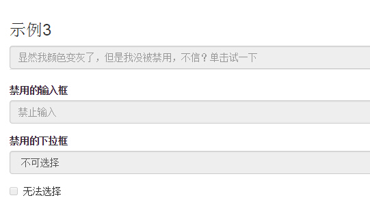


据说对于整个禁用的域中，如果`legend`中有输入框的话，这个输入框是无法被禁用的。我们一起来验证一下：
```
<form role="form">
<fieldset disabled>
<legend><input type="text" class="form-control" placeholder="显然我颜色变灰了，但是我没被禁用，不信？单击试一下" /></legend>
    …
</fieldset>
</form>
```
**问题**
1：对于某个input的禁用，主要是与什么属性的控制有关？
```
通过input控件的disable属性
```
2:可以通过css来控制表单禁用与否吗?
```
没有找到。
自己以前的方式，是设置控件不可编辑，以及控件是只读的。
```

**总结**
1.对于当个输入框的禁用:`form-control样式`+`disable属性`
2.对于整个form的禁用：`fieldset标签`+`disable属性`
    特别要主要如果需要`fieldset标签`内部有`legent标签`的时候就不能正常的禁用了。
    
    
### 表单控件状态(验证状态)
在制作表单时，不免要做表单验证。同样也需要提供验证状态样式，在Bootstrap框架中同样提供这几种效果。
1、.has-warning:警告状态（黄色）
2、.has-error：错误状态（红色）
3、.has-success：成功状态（绿色）
使用的时候只需要在form-group容器上对应添加状态类名。
```
<form role="form">
<div class="form-group has-success">
  <label class="control-label" for="inputSuccess1">成功状态</label>
  <input type="text" class="form-control" id="inputSuccess1" placeholder="成功状态" >
</div>
<div class="form-group has-warning">
  <label class="control-label" for="inputWarning1">警告状态</label>
  <input type="text" class="form-control" id="inputWarning1" placeholder="警告状态">
</div>
<div class="form-group has-error">
  <label class="control-label" for="inputError1">错误状态</label>
  <input type="text" class="form-control" id="inputError1" placeholder="错误状态">
</div>
</form>
```
运行效果如下或查看右侧结果窗口：
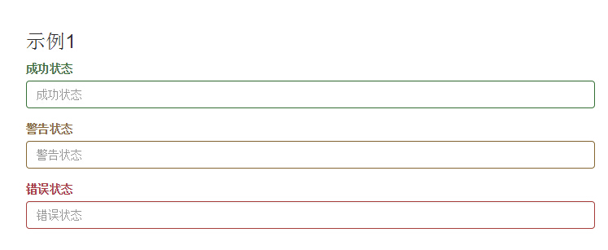

从效果可以看出，三种状态下效果都是一样的，只是颜色不一样而以。

其他两种状态省略源码不在此展示。
很多时候，在表单验证的时候，不同的状态会提供不同的 icon，比如成功是一个对号（√），错误是一个叉号（×）等。
在Bootstrap框中也提供了这样的效果。如果你想让表单在对应的状态下显示 icon 出来，只需要在对应的状态下添加类名“has-feedback”。
请注意，此类名要与“has-error”、“has-warning”和“has-success”在一起：
```
<form role="form">
<div class="form-group has-success has-feedback">
  <label class="control-label" for="inputSuccess1">成功状态</label>
  <input type="text" class="form-control" id="inputSuccess1" placeholder="成功状态" >
  <span class="glyphiconglyphicon-ok form-control-feedback"></span>
</div>
<div class="form-group has-warning has-feedback">
  ......
</div>
<div class="form-group has-error has-feedback">
  ......
</div>
</form>
```
运行效果如下或查看右侧结果窗口：


从效果图中可以看出，图标都居右。在 Bootstrap 的小图标都是使用@font-face来制作（后面的内容中将会着重用一节内容来介绍）。
而且必须在表单中添加了一个 span 元素：下面的例子是一个警告的例子。
```
<span class="glyphiconglyphicon-warning-sign form-control-feedback"></span>   
```

**主要解决的问题**
在表单验证的不同阶段，对于表单的一些处理，
1：从边框颜色上来看
2：给用户反馈消息类型，并因此作出下一步的操作。

### 表单提示信息

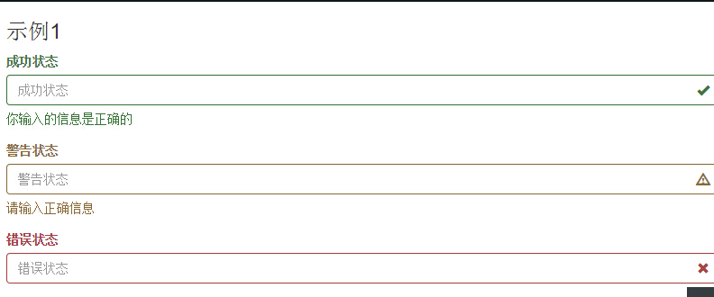

`help-block`

`help-inline`

### 按钮

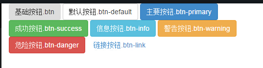

与按钮有关的class包括：
`btn`
`btn-default`
`btn-primary`
等等吧!

**按钮不同属性的详细说明**
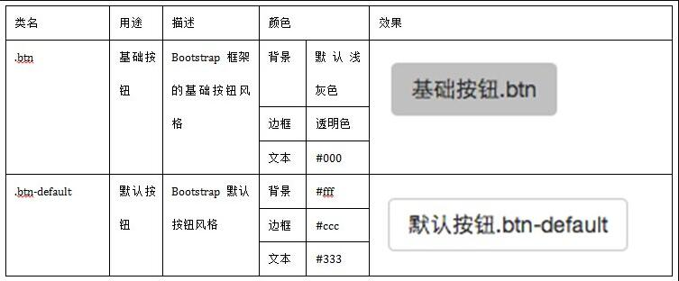

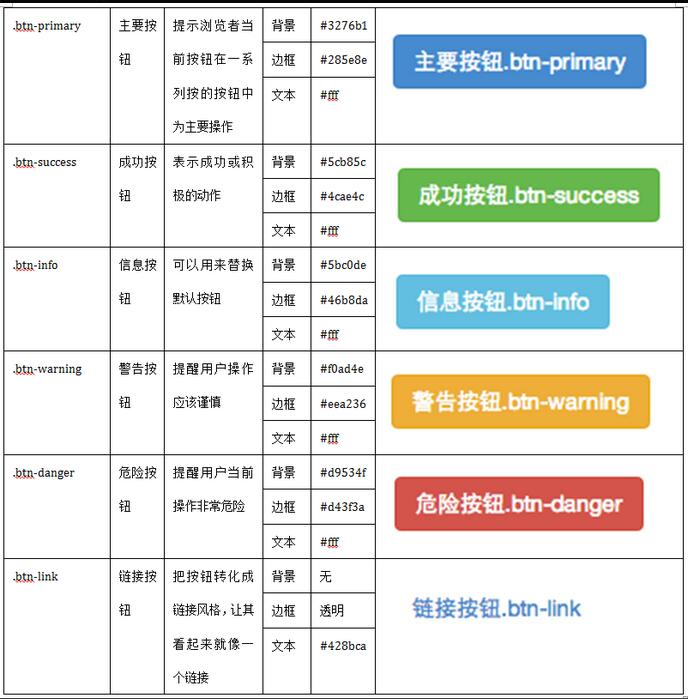

**按钮的大小控制class**
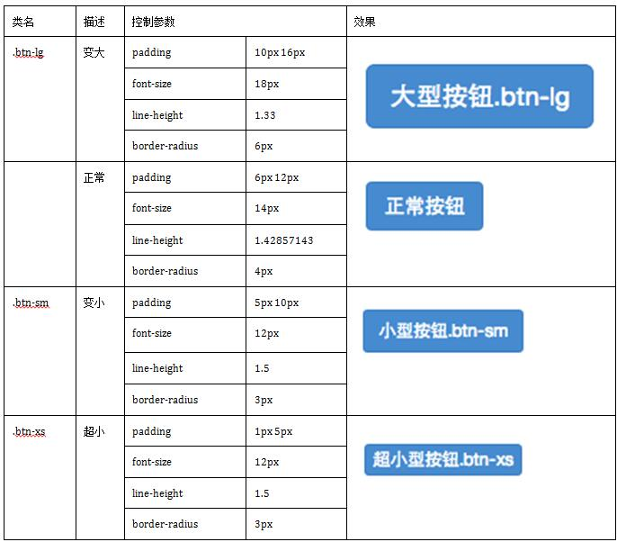

**块状按钮**
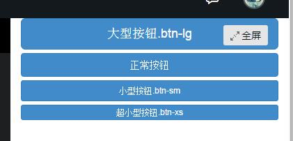
这个主要是通过`btn-block`属性来实现。

**禁用状态有两种方式**
1.input 控件的disabled属性
2.使用bootstrap提供的class，disabled


### 图像
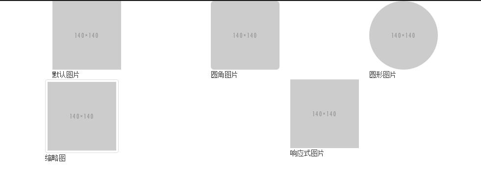

1、img-responsive：响应式图片，主要针对于响应式设计
2、img-rounded：圆角图片
3、img-circle：圆形图片
4、img-thumbnail：缩略图片

### 图标
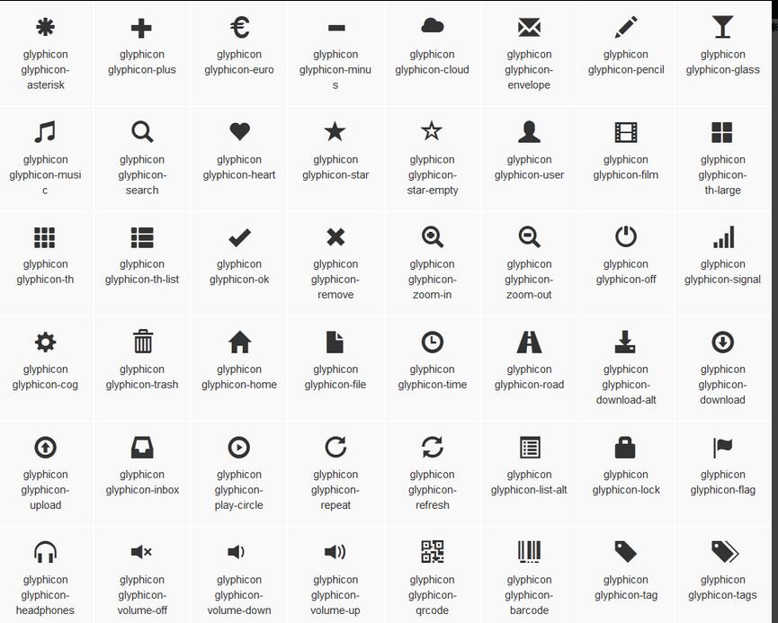

图标会在很多的地方使用到，比如说表单验证。
或者按钮图标等等，可能需要更多的操作。

主要需要关注的属性为`glyphicon`

可以在这个网站查看图标的一些详细信息
http://getbootstrap.com/components/#glyphicons


   
    
    
    
    
    
    
    
    
  
