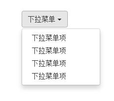
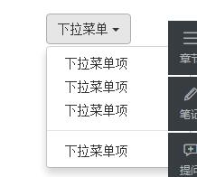
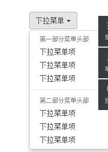
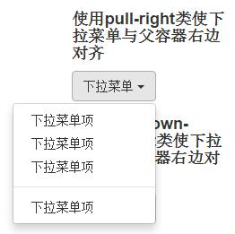
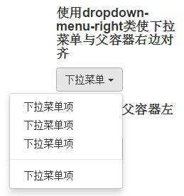
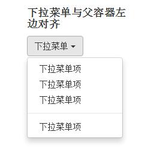
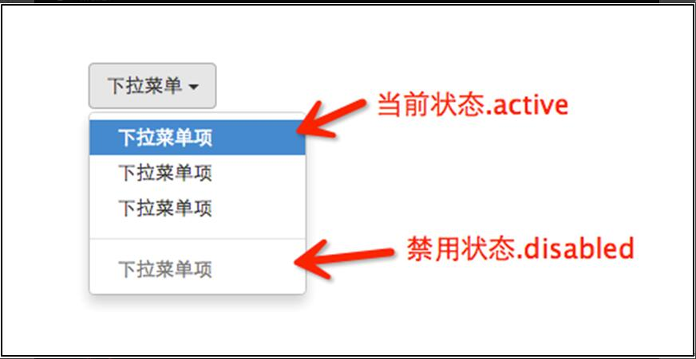
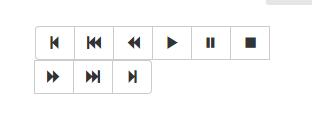
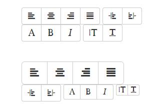

## 下拉菜单

**注意事项**
在使用Bootstrap框架的下拉菜单时，必须调用Bootstrap框架提供的bootstrap.js文件。

**有关的class**
1.dropdown
2.dropdown-toggle
3.dropdown-menu

**有关的属性**
1.data-toggle

**实现原理**
就是通过控制`display:none` 以及`display:block`这两个属性来达到想要的效果的。

### 下拉菜单（下拉分隔线）

**有关的类名**
`divider`
 
### 下拉菜单（菜单标题）

**有关的class**
`dropdown-header`

### 下拉菜单（对齐方式）

**相关的类**
`pull-right`
`dropdown-menu-right`

### 下拉菜单（菜单项状态）

**相关的class**
`active`
`disabled`

### 按钮（按钮组）

**相关的class**
`btn-group`
`glyphicon `

### 按钮（按钮工具栏）

**相关的class**
`btn-toolbar`

