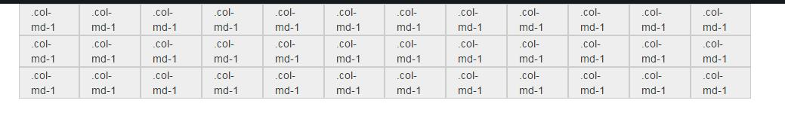
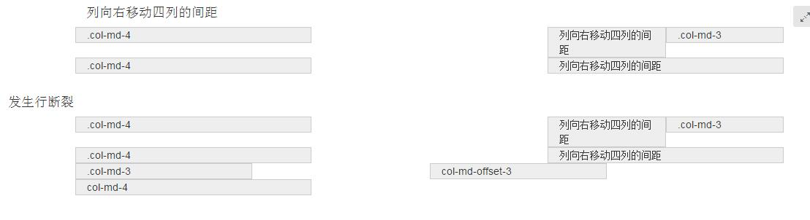

## 平分12个单元格的网格


与网格有关的属性包括
1.container
2.row
3.col-md-1

## 工作原理
1.数据行(.row)必须包含在容器（.container）中，以便为其赋予合适的对齐方式和内距(padding)。如：
```
<div class="container">
<div class="row"></div>
</div>
```
2.在行(.row)中可以添加列(.column)，但`列数之和`不能超过平分的总列数，比如12。如：
```
<div class="container">
<div class="row">
  <div class="col-md-4"></div>
  <div class="col-md-8"></div>
```
3.具体内容应当放置在列容器（column）之内，而且只有列（column）才可以作为行容器(.row)的直接子元素
4.通过设置内距（padding）从而创建列与列之间的间距。
然后通过为第一列和最后一列设置负值的外距（margin）来抵消内距(padding)的影响

**如果网格的行数超过12会怎样？**
会移动到下一行中，因此最好定义为12，否则会有意向不到的结果。----这个现象叫做断行。

`guyroutledge`在他的教程中就提到了网格系统的实现。主要是利用浮动定位和宽度百分比实现的。


### 列偏移


**相关的class**
`col-md-offset-4`

**实现原理**
主要是通过设置margin-left设置百分比来达到这个效果的。


### 列排序
其实就是改变列的排序。


**相关的class**
`col-md-push-8` 和 `col-md-pull-4`

**实现的原理**
通过控制left和right属性来达到效果。

### 列的嵌套
其实就是在某个列下新增列，把列分成好几列


**相关的class**
无

**如果实现**
直接在需要内嵌的地方插入代码就可以了


