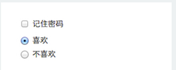

## 基础表单
**表单主要功能**
是用来与用户做交流的一个网页控件，良好的表单设计能够让网页与用户更好的沟通。
**表单中常见的元素主要包括：**
`文本输入框、下拉选择框、单选按钮、复选按钮、文本域和按钮`等。其中每个控件所起的作用都各不相同，而且不同的浏览器对表单控件渲染的
风格都各有不同。

同样，表单也是Bootstrap框架中的核心内容，下面向大家介绍Bootstrap框架中表单的制作。

**表单源码查询**

Bootstrap框架的表单，其源码占据了大量的代码，同样的，根据不同的Bootstrap版本，你可以轻松获取相应的源码：

   ?   LESS版本：对应源文件 forms.less

   ? ?  Sass版本：对应源文件 _forms.scss

编译后的Bootstrap版本，可以查阅bootstrap.css文件第1630行~第1991行

不过在样式表中，还对表单做了一些初始化，详细代码可以查阅bootstrap.css文件第110行~第178行。

对于基础表单，Bootstrap并未对其做太多的定制性效果设计，仅仅对表单内的fieldset、legend、label标签进行了定制。如：
```
/*源码请查阅bootstrap.css文件第1631行~第1652行*/

fieldset {
min-width: 0;
padding: 0;
margin: 0;
border: 0;
}
legend {
display: block;
width: 100%;
padding: 0;
margin-bottom: 20px;
font-size: 21px;
line-height: inherit;
color: #333;
border: 0;
border-bottom: 1px solid #e5e5e5;
}

label {
display: inline-block;
margin-bottom: 5px;
font-weight: bold;
}
```
主要将这些元素的margin、padding和border等进行了细化设置。

**form-control类的作用**
当然表单除了这几个元素之外，还有input、select、textarea等元素，在Bootstrap框架中，通过定制了一个类名`form-control`，
也就是说，如果这几个元素使用了类名“form-control”，将会实现一些设计上的定制效果。

1、宽度变成了100%
```
width: 100%;
```
2、设置了一个浅灰色（#ccc）的边框
```
  border: 1px solid #ccc;
```
3、具有4px的圆角
```
border-radius: 4px;
```
4、设置阴影效果，并且元素得到焦点之时，阴影和边框效果会有所变化
```
  border-color: #66afe9;
  outline: 0;
  -webkit-box-shadow: inset 0 1px 1px rgba(0,0,0,.075), 0 0 8px rgba(102, 175, 233, .6);
          box-shadow: inset 0 1px 1px rgba(0,0,0,.075), 0 0 8px rgba(102, 175, 233, .6);
```
5、设置了placeholder的颜色为#999
```
.form-control::-moz-placeholder {
  color: #999;
  opacity: 1;
}
.form-control:-ms-input-placeholder {
  color: #999;
}
.form-control::-webkit-input-placeholder {
  color: #999;
}
```
6:设置了display:block
```
display: block;
```


详细请查阅bootstrap.css文件第1690行~第1732行。

### 
水平表单
Bootstrap框架默认的表单是垂直显示风格，但很多时候我们需要的水平表单风格（标签居左，表单控件居右）见下图。


在Bootstrap框架中要实现水平表单效果，必须满足以下两个条件：
1、在`<form>`元素是使用类名“form-horizontal”。
2、配合Bootstrap框架的网格系统。（网格布局会在以后的章节中详细讲解）

在`<form>`元素上使用类名“form-horizontal”主要有以下几个作用：
1、设置表单控件padding和margin值。
2、改变“form-group”的表现形式，类似于网格系统的“row”。(这个可能是网格系统设置导致的发现在form-horizontal使用了清除浮动
说明网格系统的实现依赖的浮动定位)

```
/*源码请查阅bootstrap.css文件第1963行~第1991行*/
.form-horizontal .control-label,
.form-horizontal .radio,
.form-horizontal .checkbox,
.form-horizontal .radio-inline,
.form-horizontal .checkbox-inline {
padding-top: 7px;
margin-top: 0;
margin-bottom: 0;
}
.form-horizontal .radio,
.form-horizontal .checkbox {
min-height: 27px;
}
.form-horizontal .form-group {
margin-right: -15px;
margin-left: -15px;
}
.form-horizontal .form-control-static {
padding-top: 7px;
}
@media (min-width: 768px) {
.form-horizontal .control-label {
text-align: right;
  }
}
.form-horizontal .has-feedback .form-control-feedback {
top: 0;
right: 15px;
}
```

来看一个简单的示例：
```
<form class="form-horizontal" role="form">
<div class="form-group">
  <label for="inputEmail3" class="col-sm-2 control-label">邮箱</label>
  <div class="col-sm-10">
  <input type="email" class="form-control" id="inputEmail3" placeholder="请输入您的邮箱地址">
  </div>
  </div>
  <div class="form-group">
  <label for="inputPassword3" class="col-sm-2 control-label">密码</label>
  <div class="col-sm-10">
  <input type="password" class="form-control" id="inputPassword3" placeholder="请输入您的邮箱密码">
  </div>
  </div>
  <div class="form-group">
  <div class="col-sm-offset-2 col-sm-10">
  <div class="checkbox">
  <label>
  <input type="checkbox">记住密码
  </label>
  </div>
  </div>
  </div>
  <div class="form-group">
  <div class="col-sm-offset-2 col-sm-10">
  <button type="submit" class="btnbtn-default">进入邮箱</button>
  </div>
</div>
</form>
```
最后的效果


### 内联表单
有时候我们需要将表单的控件都在一行内显示，类似这样的：


在Bootstrap框架中实现这样的表单效果是轻而易举的，你只需要在`<form>`元素中添加类名`“form-inline”`即可。
内联表单实现原理非常简单，欲将表单控件在一行显示，就需要将表单控件设置成内联块元素（display:inline-block）。
/*源码请查阅bootstrap.css文件第1928行~第1962行*/
```
  .form-inline .form-group {
    display: inline-block;
    margin-bottom: 0;
    vertical-align: middle;
  }
```


如果你要在input前面添加一个label标签时，会导致input换行显示。如果你必须添加这样的一个label标签，并且不想让input换行，
你需要将label标签也放在容器“form-group”中，如：
```
<div class="form-group">
    <label class="sr-only" for="exampleInputEmail2">Email address</label>
</div>
<div class="form-group">
    <input type="email" class="form-control" id="exampleInputEmail2" placeholder="Enter email">
</div>
```

接下来，我们还是以实例说话：
```
<form class="form-inline" role="form">
<div class="form-group">
  <label class="sr-only" for="exampleInputEmail2">邮箱</label>
  <input type="email" class="form-control" id="exampleInputEmail2" placeholder="请输入你的邮箱地址">
</div>
<div class="form-group">
  <label class="sr-only" for="exampleInputPassword2">密码</label>
  <input type="password" class="form-control" id="exampleInputPassword2" placeholder="请输入你的邮箱密码">
</div>
<div class="checkbox">
<label>
   <input type="checkbox">记住密码
</label>
</div>
<button type="submit" class="btnbtn-default">进入邮箱</button>
</form>
```
运行效果如下或查看右侧结果窗口：(查看效果需要把结果窗口设置为全屏)


回过头来看示例，你或许会问，为什么添加了label标签，而且没有放置在”form-group”这样的容器中，input也不会换行；
还有label标签怎么没显示出来。如果你仔细看，在label标签运用了一个类名“sr-only”，标签没显示就是这个样式将标签隐藏了。
```
/*源码请查阅bootstrap.css文件第342行~第350行*/
.sr-only {
position: absolute;
width: 1px;
height: 1px;
padding: 0;
margin: -1px;
overflow: hidden;
clip: rect(0, 0, 0, 0);
border: 0;
}
```
注意：那么Bootstrap为什么要这么做呢？这样不是多此一举吗？其实不是的，如果没有为输入控件设置label标签，屏幕阅读器将无法正确识别。
这也是Bootstrap框架另一个优点之处，为残障人员进行了一定的考虑。

如果
**总结**
这个地方还是很值得学习的
1：css优先级,,权重
2：display:inline-block下的width属性如果设置为百分比的形式，这个时候会发生什么。


### 表单控件(输入框input)
在Bootstrap中使用`input时也必须添加type类型`，如果没有指定type类型，将无法得到正确的样式，
因为Bootstrap框架都是通过`input[type=“?”](其中?号代表type类型，比如说text类型，对应的是input[type=“text”])`的形式来
定义样式的。

为了让控件在各种表单风格中样式不出错，需要添加类名“form-control”，如：
```
<form role="form">
<div class="form-group">
<input type="email" class="form-control" placeholder="Enter email">
</div>
</form>
```

**总结**

* 在bootstrap中并没有为`input[type="email"]`专门的设置样式。`email`的样式其实是来自于`form-control`
* 对于`form-control`的样式是需要记住的
    1.宽度为100%的块状元素
    2.高度为34px，字体大小为14px，
    3：字体颜色，背景颜色，背景图片。
    4：边框，边框是有弧度的。
* `form-group` 
    1.清除浮动
    2.设置底部外边距

### 表单控件(下拉选择框select)
Bootstrap框架中的下拉选择框使用和原始的一致，多行选择设置multiple属性的值为multiple。
Bootstrap框架会为这些元素提供统一的样式风格。如：
```
<form role="form">
<div class="form-group">
  <select class="form-control">
    <option>1</option>
    <option>2</option>
    <option>3</option>
    <option>4</option>
    <option>5</option>
  </select>
  </div>
  <div class="form-group">
  <select multiple class="form-control">
    <option>1</option>
    <option>2</option>
    <option>3</option>
    <option>4</option>
    <option>5</option>
  </select>
</div>
</form>
```

**总结**

* 其实重点还是两个class，`form-group`和`form-control`

### 表单控件(文本域textarea)
文本域和原始使用方法一样，设置`rows`可定义其高度，设置`cols`可以设置其宽度。

**特别注意的地方**
如果textarea元素中添加了类名“form-control”类名，则`无需设置cols属性`。
因为Bootstrap框架中的“form-control”样式的表单控件宽度为100%或auto。
```
<form role="form">
  <div class="form-group">
    <textarea class="form-control" rows="3"></textarea>
  </div>
</form>
```

### 表单控件(复选框checkbox和单选择按钮radio)

Bootstrap框架中checkbox和radio有点特殊，
主要是checkbox和radio与label标签配合使用会出现一些小问题（最头痛的是`对齐问题`）。
>那么对齐问题在bootstrap中是如何处理的呢？ 

使用Bootstrap框架，开发人员无需考虑太多，只需要按照下面的方法使用即可。
```
<form role="form">
<div class="checkbox">
<label>
<input type="checkbox" value="">
记住密码
</label>
</div>
<div class="radio">
<label>
<input type="radio" name="optionsRadios" id="optionsRadios1" value="love" checked>
喜欢
</label>
</div>
<div class="radio">
<label>
<input type="radio" name="optionsRadios" id="optionsRadios2" value="hate">
不喜欢
</label>
</div>
</form>
```
运行效果如下或查看右侧结果窗口（案例1）：




从上面的示例，我们可以得知：
1、不管是checkbox还是radio都使用label包起来了
2、checkbox连同label标签放置在一个名为“.checkbox”的容器内
3、radio连同label标签放置在一个名为“.radio”的容器内
在Bootstrap框架中，主要借助“.checkbox”和“.radio”样式，来处理复选框、单选按钮与标签的对齐方式。
源码请查看bootstrap.css文件第1742行～第1762行：
```
.radio,
.checkbox {
display: block;
min-height: 20px;
padding-left: 20px;
margin-top: 10px;
margin-bottom: 10px;
}
.radio label,
.checkbox label {
display: inline;
font-weight: normal;
cursor: pointer;
}
.radio input[type="radio"],
.radio-inline input[type="radio"],
.checkbox input[type="checkbox"],
.checkbox-inline input[type="checkbox"] {
float: left;
margin-left: -20px;
}
.radio + .radio,
.checkbox + .checkbox {
margin-top: -5px;
}
```
**总结**
1：为什么不使用“fom-group”进行包裹，要使用"checkbox"或者是"radio"来进行包裹
    1.checkbox,radio使用了盒子模型进行定位。还有块状元素和最小高度的定位机制来实现。
    2.`form-group`只是实现了浮动定位和底部的外边距。
    
    
  
