### 什么是bootstrap
* 简单灵活可用于架构流行的用户界面和交互接口的html、css、javascript工具集。
* 基于html5、css3的bootstrap，具有大量的诱人特性：友好的学习曲线，卓越的兼容性，响应式设计，12列格网，样式向导文档。
* 自定义JQuery插件，完整的类库，基于Less等。

>在慕课网上关于bootstrap的课程，《系列:玩转Bootstrap》《分享：响应式布局》

### 如何开始使用Bootstrap
1:官网
http://www.bootcss.com/

2：注意
bootstrap中的js插件依赖于jquery，因此`jquery`要在bootstrap之前引入。
bootstrap不支持IE的兼容模式。


viewport


bootstrap模板为使IE6、7、8版本（IE9以下版本）浏览器兼容html5新增的标签，引入下面代码文件即可。
```
<script src="https://oss.maxcdn.com/libs/html5shiv/3.7.0/html5shiv.js"></script>
```
同理为使IE6、7、8版本浏览器兼容css3样式，引入下面代码：
```
<script src="https://oss.maxcdn.com/libs/respond.js/1.4.2/respond.min.js"></script>
```

### 全局样式
其实Bootstrap的全局样式采用了“normalize.css”，但并没有一味的全部使用此重置样式，而是在此基础上进行了一些改良，
让其更适合Bootstrap的设计思想。

你可以通过“normalize.less”（LESS版本）或“_normalize.scss”（Sass版本）进行深入的了解。


## 标题----`不是重点`
Bootstrap和普通的HTML页面一样，定义标题都是使用标签`<h1>`到`<h6>`,只不过Bootstrap覆盖了其默认的样式，
使用其在所有浏览器下显示的效果一样，具体定义的规则可以如下表所示：
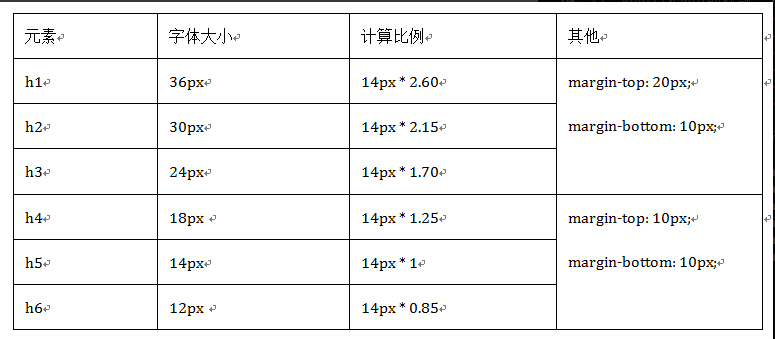
通过比较可以发现，Bootstrap标题样式进行了以下显著的优化重置：

1、重新设置了`margin-top`和`margin-bottom`的值，`h1~h3`重置后的值都是`20px`；`h4~h6`重置后的值都是`10px`。
2、所有标题的行高都是`1.1`（也就是font-size的1.1倍）,而且文本颜色和字体都继承父元素的颜色和字体。
3、固定不同级别标题字体大小，`h1=36px，h2=30px，h3=24px，h4=18px，h5=14px和h6=12px。`

标题的具体运用非常简单，和我们平时运用是一样的，使用`<h1>~<h6>`标签，分别表示标题一至标题六，h 后面的数字越大，表示级别越小，文本也越小。来看一个简单的效果：右侧代码编辑器中的10-16行的代码。

在Bootstrap中为了让非标题元素和标题使用相同的样式，还特意定义了.h1~.h6六个类名。如右侧代码编辑器中   18-23行代码所示：

对比两个示例的效果图，可以说他们的效果是一模一样

```
<!DOCTYPE HTML>
<html>
<head>
<meta charset="utf-8">
<title>标题（一）</title>
<link rel="stylesheet" href="http://netdna.bootstrapcdn.com/bootstrap/3.1.1/css/bootstrap.min.css">
</head>

<body>
<!--Bootstrap中的标题-->
<h1>Bootstrap标题一</h1>
<h2>Bootstrap标题二</h2>
<h3>Bootstrap标题三</h3>
<h4>Bootstrap标题四</h4>
<h5>Bootstrap标题五</h5>
<h6>Bootstrap标题六</h6>

<!--Bootstrap中让非标题元素和标题使用相同的样式-->
<div class="h1">Bootstrap标题一</div>
<div class="h2">Bootstrap标题二</div>
<div class="h3">Bootstrap标题三</div>
<div class="h4">Bootstrap标题四</div>
<div class="h5">Bootstrap标题五</div>
<div class="h6">Bootstrap标题六</div>

<!--任务填写下方-->
<h1>我的第一个bootstrap标题</h1>

    
</body>
</html>
```
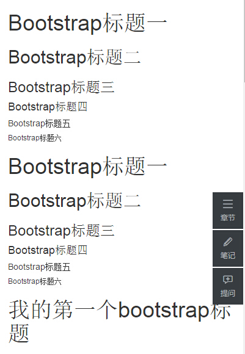

### 副标题
除此之外，我们在Web的制作中，常常会碰到在一个标题后面紧跟着一行小的副标题。
在Bootstrap中他也考虑了这种排版效果，使用了`<small>`标签来制作`副标题`。这个副标题具有其自己的一些独特样式：

1、`行高`都是1，而且`font-weight`设置了normal变成了常规效果（不加粗），同时颜色被设置为灰色（#999）。
2、由于`<small>`内的文本字体在`h1~h3`内，其大小都设置为`当前字号的65%`；而在`h4~h6`的字号都设置为`当前字号的75%`；
详细代码请参阅bootstrap.css文件中第407行~第443行。

```
<!DOCTYPE HTML>
<html>
<head>
<meta charset="utf-8">
<title>标题（二）</title>
<link rel="stylesheet" href="//netdna.bootstrapcdn.com/bootstrap/3.1.1/css/bootstrap.min.css">
</head>

<body>

<!--Bootstrap中使用了<small>标签来制作副标题-->
<h1>Bootstrap标题一<small>我是副标题</small></h1>
<h2>Bootstrap标题二<small>我是副标题</small></h2>
<h3>Bootstrap标题三<small>我是副标题</small></h3>
<h4>Bootstrap标题四<small>我是副标题</small></h4>
<h5>Bootstrap标题五<small>我是副标题</small></h5>
<h6>Bootstrap标题六<small>我是副标题</small></h6>

<!--任务填写处-->

<h1>孤儿院无私奉献30年 <small> 一曲人性的赞歌</small></h1>
</body>
</html>
```
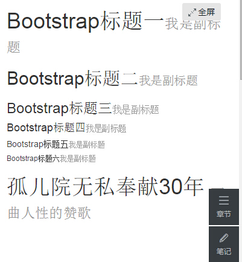

## 段落（正文文本）-----`不是重点`
**正文文本：**
1、`font-size`全局文本字号为14px(`font-size`)。
2、`line-height`行高为1.42857143（`line-height`），大约是20px(大家看到一串的小数或许会有疑惑，其实他是通过LESS编译器计算出来的，
当然Sass也有这样的功能)。
3、`color`颜色为深灰色（#333）；
4、`font-family`字体为"Helvetica Neue", Helvetica, Arial, sans-serif;（font-family），或许这样的字体对我们中文并不太合适，
但在实际项目中，大家可以根据自己的需求进行重置，在此我们不做过多阐述，我们回到这里。该设置都定义在<body>元素上，
由于这几个属性都是继承属性，所以Web页面中文本（包括段落p元素）如无重置都会具有这些样式效果。
/*源码请查看bootstrap.css文件中第274行~280行*/
```
body {
font-family: "Helvetica Neue", Helvetica, Arial, sans-serif;
font-size: 14px;
line-height: 1.42857143;
color: #333;
background-color: #fff;
}
```

**段落**
/*源码请查看bootstrap.css文件中第467行~469行*/
```
p {
 margin: 0 0 10px;
}
```

**总结**
1：使用方式，还是使用p标签。
2：默认大小，可以在chrome调试工具中查看到。
3：感觉这个地方不是重点

## 强调内容----`不是重点`
###在html中我们如何强调问题的方法
1：设置一个class，写出我们预先处理的class，然后在特定的标签上添加上这个class....
比如：font-weight:bold可以实现实现加粗效果，font-size设置文字的大小，color设置文字的颜色。font-family设置字体等等
background可以设置一些背景颜色或者图片等等。
2:使用一些html标签
```
<strong></strong>加粗文本
<em></em>这意味着要把这段文字用斜体来显示
<cite></cite>引用
<small></small>小号字体
<b> 标签规定粗体文本。
<i> 标签显示斜体文本效果。
```


### 在bootstrap中我们可以如何使用
```
<p>我是普通文本，我的样子长成这样我是普通文本，我的样子长成这样我是普通文本，</p>
<p class="lead">我是特意要突出的文本，我的样子成这样。我是特意要突出的文本，我的样子长成这样。</p>
```

**一些常见的强调**
.text-muted：提示，使用浅灰色（#999）
.text-primary：主要，使用蓝色（#428bca）
.text-success：成功，使用浅绿色(#3c763d)
.text-info：通知信息，使用浅蓝色（#31708f）
.text-warning：警告，使用黄色（#8a6d3b）
.text-danger：危险，使用褐色（#a94442）
具本源码查看bootstrap.css文件第500行~第532行：

```
<!DOCTYPE HTML>
<html>
<head>
<meta charset="utf-8">
<title>强调相关的类</title>
<link rel="stylesheet" href="//netdna.bootstrapcdn.com/bootstrap/3.1.1/css/bootstrap.min.css">
</head>

<body>
<div class="text-muted">.text-muted 效果</div>
<div class="text-primary">.text-primary效果</div>
<div class="text-success">.text-success效果</div>
<div class="text-info">.text-info效果</div>
<div class="text-warning">.text-warning效果</div>
<div class="text-danger">.text-danger效果</div>
<!--下面是任务部分-->
<p>我是一段危险信息，请用Bootstrap框架中的危险风格显示</p>
</body>
</html>
```

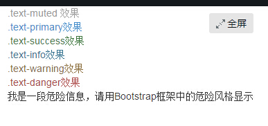


**总结：**
1：可以由多种实现
2：这个不是重点

## 文本对齐风格-----`不是重点`

对于text-align属性的封装
```
.text-left {
text-align: left;
}
.text-right {
text-align: right;
}
.text-center {
text-align: center;
}
.text-justify {
text-align: justify;
}
```
html代码
```
<!DOCTYPE HTML>
<html>
<head>
<meta charset="utf-8">
<title>文本对齐风格</title>
<link rel="stylesheet" href="//netdna.bootstrapcdn.com/bootstrap/3.1.1/css/bootstrap.min.css">
</head>

<body>
<p class="text-left">我居左</p>
<p class="text-center">我居中</p>
<p class="text-right">我居右</p>
<p class="text-justify">There is clearly a need for CSS to be taken seriously by graphic artists. The Zen Garden aims to excite, inspire, and encourage participation. To begin, view some of the existing designs in the list. Clicking on any one will load the style sheet into this very page. The code remains the same, the only thing that has changed is the external .css file. </p>
<!--下面是任务部分-->
<p class="text-right">给我加个类，我就向右对齐。</p>


</body>
</html>
```
最后的效果

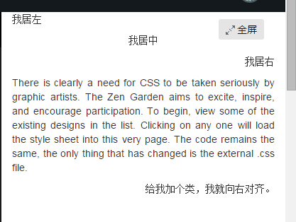

**总结**
这个不是重点

## 列表-------`不是重点`

1：元素的html中有3中列表

* 无序列表
* 有序列表
* 定义列表

２：Bootstrap根据平时的使用情形提供了六种形式的列表：
   ?  普通列表

   ?  有序列表

   ?  去点列表

   ?  内联列表

   ?  描述列表

   ?  水平描述列表

**列表嵌套**
```
<h5>有序列表嵌套</h5>
<ol>
    <li>有序列表</li>
    <li>
    有序列表
        <ol>
        <li>有序列表(2)</li>
        <li>有序列表(2)</li>
        </ol>
    </li>
    <li>有序列表</li>
</ol>
```
效果图
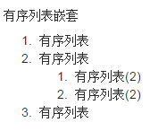
**列表--去点列表**
主要是控制`list-style-type:none`这个也是很简单的
bootstrap提供了一个`class="list-unstyled"`
想要了解详情的话，可以查看源码

**列表--内联列表**
我们常常使用列表做菜单栏的使用。通过控制`list-style-type:none`和`display:inline-block`来实现。
bootstrap提供了一个 `class="list-inline"`
想要了解详情的话，可以查看源码

**总结**
不是重点

## 代码
本节内容相对来说比较简单，一般在个人博客上使用的较为频繁，用于显示代码的风格。在Bootstrap主要提供了三种代码风格：
1、使用`<code></code>`来显示单行内联代码
2、使用`<pre></pre>`来显示多行块代码
3、使用`<kbd></kbd>`来显示用户输入代码

预编译版本的Bootstrap将代码的样式单独提取出来：
1、LESS版本，请查阅code.less文件
2、Sass版本，请查阅_code.scss文件
编译出来的CSS代码请查阅bootstrap.css文件第688行~第730行，由于代码太长，此处不一一列举。

在使用代码时，用户可以根据具体的需求来使用不同的类型：
1、`<code>`：一般是针对于单个单词或单个句子的代码
2、`<pre>`：一般是针对于多行代码（也就是成块的代码）
3、`<kbd>`:一般是表示用户要通过键盘输入的内容

html代码
```
<body>
code风格：
<div>Bootstrap的代码风格有三种：<code>&lt;code&gt;</code>、<code>&lt;pre&gt;</code>和<code>&lt;kbd&gt;</code></div>
pre风格：
<div>
<pre>
&lt;ul&gt;
&lt;li&gt;...&lt;/li&gt;
&lt;li&gt;...&lt;/li&gt;
&lt;li&gt;...&lt;/li&gt;
&lt;/ul&gt;
</pre>
</div>
kbd风格：
<div>请输入<kbd>ctrl+c</kbd>来复制代码，然后使用<kbd>ctrl+v</kbd>来粘贴代码</div>


<!--下面是代码任务部分-->

<p>请使用<kbd>ctrl+x</kbd>复制代码，然后使用<kbd>cctrl+shift+v</kbd>将复制的代码粘贴到需要的地方。</p>


</body>
```

页面效果
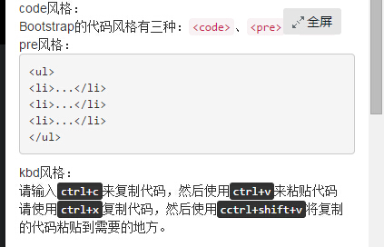

**控制代码的最大高度**
```
高度超出340px，就会在Y轴出现滚动条
<!--下面是代码任务部分-->
<pre class="pre-scrollable">
<ol>
    <li>....</li>
    <li>....</li>
    <li>....</li>
    <li>....</li>
    <li>....</li>
    <li>....</li>
    <li>....</li>
    <li>....</li>
    <li>....</li>
    <li>....</li>
    <li>....</li>
    <li>....</li>
    <li>....</li>
    <li>....</li>
</ol>
</pre>
```
最后的效果
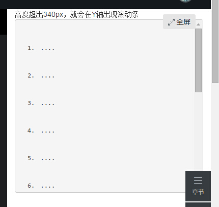


**总结**

* 这几个标签之前是没有接触过的，我觉得了解即可。
* 对于`max-height`和`overflow-y`的配合使用有学习到
 
 
## 表格
表格是Bootstrap的一个基础组件之一，Bootstrap为表格提供了1种基础样式和4种附加样式以及1个支持响应式的表格。在使用Bootstrap的表格过程中，只需要添加对应的类名就可以得到不同的表格风格，在接下来的内容中，我们会详细介绍Bootstrap的表格使用。

同样的，如果你对CSS预处理器熟悉，你可以使用Bootstrap提供的预处理版本：
  ?  LESS版本，对应的文件是 tables.less
  ?  Sass版本，对应的文件是 _tables.scss

如果你不懂LESS或Sass也不妨，你在bootstrap.css文件中第1402行~第1630行中可以查阅到所有有关于table的样式代码。由于代码太长，此处不一一列举。

刚已经说了，Bootstrap为表格不同的样式风格提供了不同的类名，主要包括：

  ?  .table：基础表格

  ?  .table-striped：斑马线表格

  ?  .table-bordered：带边框的表格

  ?  .table-hover：鼠标悬停高亮的表格

  ?  .table-condensed：紧凑型表格

  ?  .table-responsive：响应式表格
  
  
### 表格--表格行的类
Bootstrap还为表格的行元素`<tr>`提供了五种不同的类名，每种类名控制了行的不同背景颜色，具体说明如下表所示：
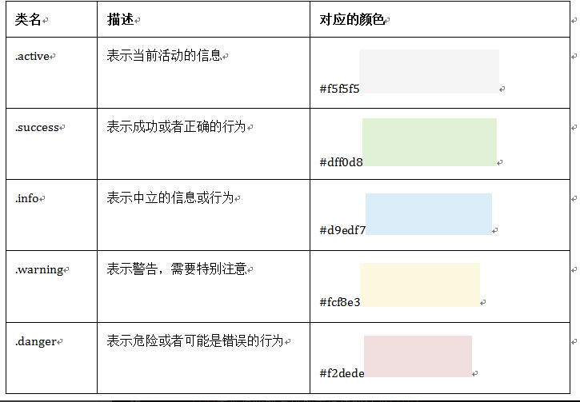

其使用非常的简单，只需要在`<tr>`元素中添加上表对应的类名，就能达到你自己需要的效果：
```
<tr class="active">
    <td>…</td>
</tr>
```
对应的源码，请查看bootstrap.css文件中第1484行~第1583行。

特别提示：除了”.active”之外，其他四个类名和”.table-hover”配合使用时，Bootstrap针对这几种样式也做了相应的悬浮状态的样式设置，所以如果需要给tr元素添加其他颜色样式时，在”.table-hover”表格中也要做相应的调整。

注意要实现悬浮状态，需要在`<table>`标签上加入table-hover类。

如下代码：
```
<table class="table-hover">
```

**总结**
1：感觉就像是预定了`background`的属性，但是我觉得并没有什么困难的。

### 表格--基础表格

大家对表格并不太陌生，但对于Bootstrap中的表格如何使用，或许还有点陌生，接下来的内容，将根据不同的表格类型向大家介绍Bootstrap表格的实际使用方法。
对表格的结构，跟我们平时使用表格是一样的：
```
<table>
<thead>
<tr>
<th>表格标题</th>
…
</tr>
</thead>
<tbody>
<tr>
<td>表格单元格</td>
…
</tr>
     …
</tbody>
</table>
```
如无特别声明，下面介绍表格类型的时候，结构都是类似上面的代码。
基础表格
在Bootstrap中，对于基础表格是通过类名“.table”来控制。如果在`<table>`元素中不添加任何类名，表格是无任何样式效果的。想得到基础表格，我们只需要在`<table>`元素上添加“.table”类名，就可以得到Bootstrap的基础表格：
```
<table class="table">
…
</table>
```
Bootstrap的基础表格，大致长得像下图所示的样子：


主要源码查看bootstrap.css文件第1402行～第1441行，由于代码太长，此处不一一列举。

“.table”主要有三个作用：

  ?  给表格设置了margin-bottom:20px以及设置单元内距

  ?  在thead底部设置了一个2px的浅灰实线

  ?  每个单元格顶部设置了一个1px的浅灰实线
  
  **总结**
  1：学些了一个class为`table`
  2: 为表格设置合并边框模型：
  ```
    .table {
      border-collapse: collapse !important;
    }
  ```
  自己以前是通过`cellspacing="0"`来控制的。
  3：对于`vertical-align`属性的了解吧
  
### 表格--斑马线表格
  
 有时候为了让表格更具阅读性，需要将表格制作成类似于斑马线的效果。简单点说就是让表格带有背景条纹效果。在Bootstrap中实现这种表格
 效果并不困难，只需要在`<table class="table">`的基础上增加类名“.table-striped”即可：
 
 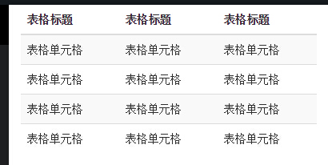
 
 ```
 <table class="table table-striped">
 …
 </table>
 ```
 其效果与基础表格相比，仅是在tbody隔行有一个浅灰色的背景色。其实现原理也非常的简单，利用CSS3的结构性选择器“:nth-child”来实现，
 所以对于IE8以及其以下浏览器，没有背景条纹效果。
 
 源码请查看bootstrap.css文件第1465行~第1468行：
 ```
 .table-striped > tbody > tr:nth-child(odd) > td,
 .table-striped > tbody > tr:nth-child(odd) > th {
 background-color: #f9f9f9;
 } 
 ```
 
 **总结**
 1：斑马线表格，需要两个属性一起控制来使用`table`,`table-striped`
 
 
### 表格--带边框的表格

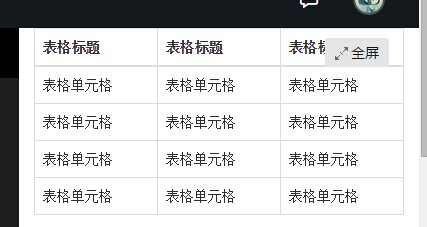
基础表格仅让表格部分地方有边框，但有时候需要整个表格具有边框效果。Bootstrap出于实际运用，也考虑这种表格效果，即所有单元格具有
一条1px的边框。Bootstrap中带边框的表格使用方法和斑马线表格的使用方法类似，只需要在基础表格`<table class="table">`基础上添加一个
“.table-bordered”类名即可：
```
<table  class="table table-bordered">
  …
</table>
```
样式如下图所示：


其源码可以查看bootstrap.css文件第1450行~第1464行：
```
.table-bordered {
  border: 1px solid #ddd;/*整个表格设置边框*/
}
.table-bordered > thead > tr > th,
.table-bordered > tbody > tr > th,
.table-bordered > tfoot > tr > th,
.table-bordered > thead > tr > td,
.table-bordered > tbody > tr > td,
.table-bordered > tfoot > tr > td {
  border: 1px solid #ddd; /*每个单元格设置边框*/
}
.table-bordered > thead > tr > th,
.table-bordered > thead > tr > td {
  border-bottom-width: 2px;/*表头底部边框*/
}
```

### 表格--鼠标悬浮高亮的表格
当鼠标悬停在表格的行上面有一个高亮的背景色，这样的表格让人看起来就是舒服，时刻告诉用户正在阅读表格哪一行的数据。
Bootstrap的确没有让你失望，他也考虑到这种效果，其提供了一个“.table-hover”类名来实现这种表格效果。
鼠标悬停高亮的表格使用也简单，仅需要`<table class="table">`元素上添加类名“table-hover”即可：
```
<table class="table table-hover">
…
</table>
```

从效果图中可以看出，当你鼠标悬浮在某一单元格上时，单元格所在行的背景色都会变成浅灰色。

鼠标悬浮高亮的效果主要是通过“hover”事件来实现，设置了“tr:hover”时的th、td的背景色为新颜色。
其源码请查看bootstrap.css文件中第1469行~第1472行：
```
.table-hover > tbody > tr:hover > td,
.table-hover > tbody > tr:hover > th {
background-color: #f5f5f5;
}
```
注：其实，鼠标悬浮高亮表格，可以和Bootstrap其他表格混合使用。简单点说，只要你想让你的表格具备悬浮高亮效果，你只要给这个表格添加“table-hover”类名就好了。例如，将前面介绍的几种表格结合使用：
```
<table class="table table-striped table-bordered table-hover">
…
</table>
```

### 表格--紧凑型表格
何谓紧凑型表格，简单理解，就是单元格没内距或者内距较其他表格的内距更小。换句话说，要实现紧凑型表格只需要重置表格单元格的内距padding的值。那么在Bootstrap中，通过类名“table-condensed”重置了单元格内距值。
紧凑型表格的运用，也只是需要在`<table class="table">`基础上添加类名“table-condensed”：
```
<table class="table table-condensed">
…
</table>
```

从上面效果图可以看出，Bootstrap中紧凑型的表格与基础表格差别不大，因为只是将单元格的内距由8px调至5px。

源码请查看bootstrap.css文件第1442行~第1449行：
```
.table-condensed > thead > tr > th,
.table-condensed > tbody > tr > th,
.table-condensed > tfoot > tr > th,
.table-condensed > thead > tr > td,
.table-condensed > tbody > tr > td,
.table-condensed > tfoot > tr > td {
padding: 5px;
}
```
正如上一小节中悬浮高亮表格中所讲解的，在Bootstrap中制作表格中，可以将上面几种表格样式结合在一起使用，从而制作出更为精美的表格。
结合的方法也很简单，就是在`<table class="table">`基础上添加你需要的表格样式类型。

另外从上面的示例中大家可能也发现了，不管制作哪种表格都离不开类名“table”。所以大家在使用Bootstrap表格时，
千万注意，你的`<table>`元素中一定不能缺少类名“table”。

**总结**
1：就是一些css样式类，其实不不需要要bootstrap自己也能写
2：这个不是重点
3：对于表格的这些样式是可以叠加使用的

### 表格--响应式表格
随着各种手持设备的出现，要想让你的Web页面适合千罗万像的设备浏览，响应式设计的呼声越来越高。在Bootstrap中也为表格提供了响应式的
效果，将其称为响应式表格。Bootstrap提供了一个容器，并且此容器设置类名“.table-responsive”,此容器就具有响应式效果，然后将
`<table class="table">`置于这个容器当中，这样表格也就具有响应式效果。Bootstrap中响应式表格效果表现为：当你的浏览器可视区域
小于768px时，表格底部会出现水平滚动条。当你的浏览器可视区域大于768px时，表格底部水平滚动条就会消失。示例如下：

```
<div class="table-responsive">
<table class="table table-bordered">
   …
</table>
</div>
```
运行效果如下：
**宽屏效果**


**窄屏效果**
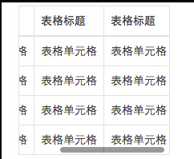

**总结**
1：这个应该是必填项吧！。

