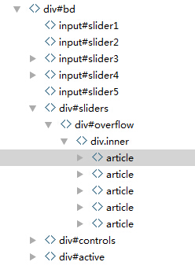

## slider实现原理
**实现slider的关键---图片切换**
* 1.点击控制按钮的时候，图片切换
* 2.图片切换的时候，保证所有的控制按钮正确显示。

## html结构

1. label作为控制按钮
2. article包含图片。

### label和article如何的建立联系？
如果把label和article直接建立联系，是很难的。
我们需要一个中间的东西。把label的切换状态记录下来。
然后通过某种手段来选择相应次序的图片来显示。

我么通过label的for属性和对应的radio对应起来。当label点击的时候，相应的radio就变成了checked的状态。
然后通过强大的css3选择器将inner向左移动。让对应的图片显示出来。

### css3选择器之--兄弟选择器

element1~element2 选择器 element1 之后出现的所有 element2。
http://www.w3school.com.cn/cssref/selector_gen_sibling.asp

参考文献：
http://www.cnblogs.com/guorui-gr/archive/2013/01/07/2849999.html